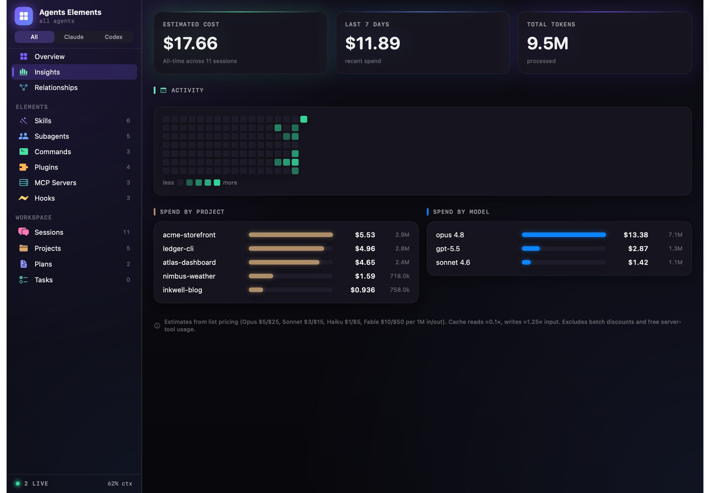
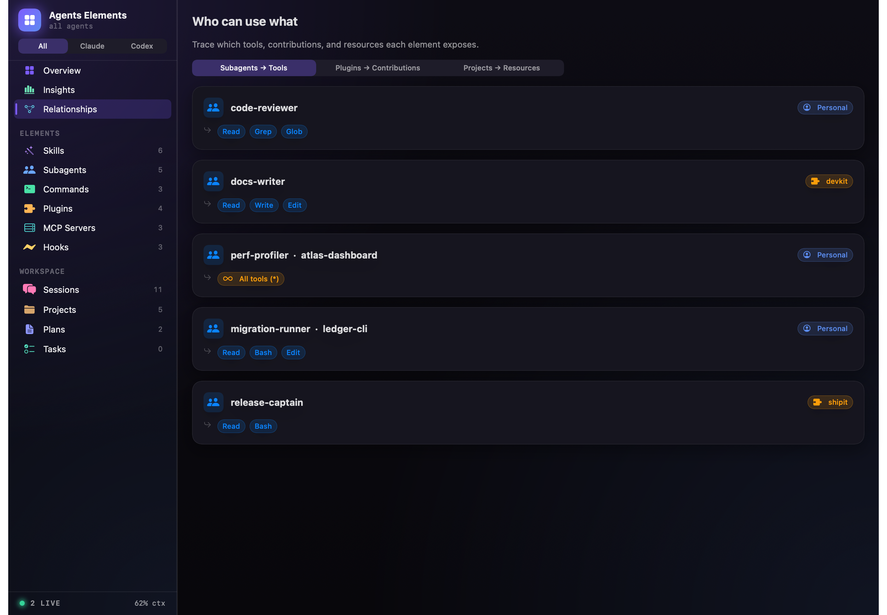
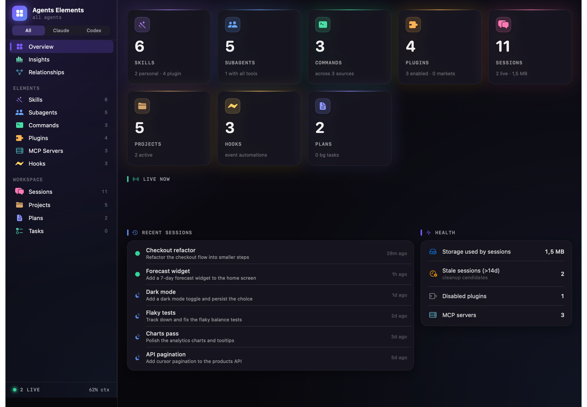
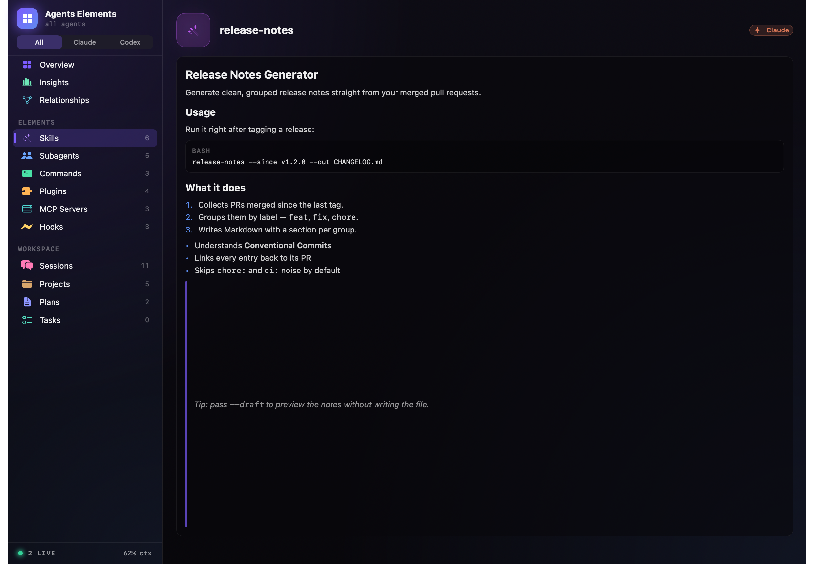

<div align="center">


_A 13-second tour — higher-quality [MP4](docs/demo.mp4)._

# Agents Elements

**A control center for everything your AI coding agents install — across Claude Code and Codex.**

[](#-built-entirely-by-an-ai-agent)
[](#install)
[](Package.swift)
[](Package.swift)
[](LICENSE)

</div>

Your coding agents quietly install a growing pile of **skills, subagents, slash commands,
plugins, MCP servers, and hooks** — and leave a long tail of **sessions** behind. There's no
single place that answers *"what's installed across all my agents, who can use what, which
sessions are still alive, and how much am I spending?"*

**Agents Elements is that place.** It scans `~/.claude` and `~/.codex`, lays everything out in
a fast native macOS app, and lets you recall sessions, audit automation, track cost, and
enable/disable plugins and skills — for **Claude Code and Codex**, together or one at a time.

> [!NOTE]
> **This entire app — code, design, icon, and docs — was built by an AI agent.** [See below.](#-built-entirely-by-an-ai-agent)

---

## Screens

| Insights — token & cost | Relationships — who can use what |
|---|---|
|  |  |

| Overview | Rendered Markdown previews |
|---|---|
|  |  |

## What you get

- **🗂 Inventory everything** — skills, subagents, commands, plugins, MCP servers and hooks in
  one searchable list, each tagged with its source and provider. Bodies render as **Markdown**
  (headings, code, lists, links) with a Rendered/Raw toggle.
- **🟢 Live & historical sessions** — Live / Resumable / Stale at a glance, with model, branch,
  message count, token usage and last prompt. Copy a recall command, Reveal in Finder, or
  clean up stale transcripts to the Trash (recoverable — never offered for live sessions).
- **📊 Insights** — estimated spend all-time and last 7 days, **by project and by model with
  Claude and GPT side by side**, plus a GitHub-style activity heatmap. Override any rate via
  `~/.config/agents-elements/pricing.json`.
- **⚡ Automation audit** — hooks grouped by event with mutating ones flagged, **Codex command
  rules**, and the `~/.claude` **sweep markers** — so when files vanish on their own, you can
  see exactly what ran and when.
- **🔌 Manage from the UI** — enable/disable plugins (Claude + Codex) and skills (Codex), each
  behind a confirmation dialog. Every write is **path-locked and backed up first.**
- **🧭 Relationships** — trace each subagent's tools, each plugin's contributions, and each
  project's scoped commands + MCP servers.
- **📍 Menu-bar extra** — live sessions and quick counts one click away.

**Look & feel — "Command Deck":** a dark, near-black mission-control canvas with a
violet→indigo accent, category-tinted glowing cards, monospace micro-labels, and live-item
halos.

## Supported agents

| Element | Claude Code (`~/.claude`) | Codex (`~/.codex`) |
|---|---|---|
| Skills | `skills/*/SKILL.md` | `skills/**/SKILL.md` (incl. `.system`) |
| Sessions | `projects/<enc>/<uuid>.jsonl` | `sessions/YYYY/MM/DD/rollout-*.jsonl` + friendly names |
| MCP servers | `~/.claude.json` | `config.toml [mcp_servers.*]` |
| Plugins | `installed_plugins.json` | `config.toml [plugins.*]` |
| Projects | encoded dirs | session cwds + `config.toml [projects.*]` trust levels |
| Hooks / guardrails | `settings.json` hooks | `rules/*.rules` command-approval rules |
| Subagents / Commands | yes | — (no Codex equivalent) |

Codex's `config.toml` is parsed with a small dependency-free TOML reader. Live-session
detection is best-effort for Codex (it runs as a desktop app), so its sessions usually show as
resumable/stale and recall uses `codex resume <id>`.

## Install

### Download

1. Grab `AgentsElements-x.y.z.zip` from the [Releases](https://github.com/LasaleFamine/agents-elements/releases) page and unzip it.
2. Move **AgentsElements.app** to `/Applications`.
3. The app is open-source and **ad-hoc signed** (not notarized by Apple), so macOS Gatekeeper
   blocks it on first launch with *"Apple could not verify…"*. To open it, either:

   **Terminal** — remove the download quarantine flag, then open:
   ```bash
   xattr -dr com.apple.quarantine /Applications/AgentsElements.app
   open /Applications/AgentsElements.app
   ```

   **or the GUI** — double-click (you'll get the block), then go to **System Settings →
   Privacy & Security**, find *"AgentsElements was blocked…"*, click **Open Anyway**, and
   confirm. (On macOS 15 Sequoia the old Control-click → Open shortcut no longer works for
   un-notarized apps — use this or the Terminal command above.)

> [!NOTE]
> This warning is normal for open-source apps distributed outside the App Store without a
> paid Apple Developer ID + notarization. You only need to do it once. Prefer no warning at
> all? **Build from source** — locally built apps aren't quarantined.

### Build from source

No full Xcode needed — the **Command Line Tools** are enough, and there are **zero
dependencies** (builds offline).

```bash
git clone https://github.com/LasaleFamine/agents-elements.git
cd agents-elements
./build.sh                 # compile + wrap into AgentsElements.app
open AgentsElements.app

./build.sh release --dist  # also produce dist/AgentsElements-<version>.zip
```

Requires macOS 14+.

## 🤖 Built entirely by an AI agent

Every part of this project — the architecture, the Swift/SwiftUI code, the "Command Deck"
visual design, the app icon, and this documentation — was **written by Claude, an AI agent,
working in [Claude Code](https://claude.com/claude-code).** A human set the direction, made
product decisions, and gave feedback; the agent did the building, including:

- choosing the tech (SwiftPM + pure SwiftUI, no dependencies, buildable with Command Line Tools only),
- reverse-engineering the on-disk layouts of `~/.claude` and `~/.codex`,
- designing the UI and rendering its own screenshots/icon via SwiftUI's `ImageRenderer`,
- and writing the guard-railed file-mutation layer and its dry-run self-test.

It's a small demonstration that an agent can take a vague idea ("a dashboard for my agents'
stuff") all the way to a finalized, distributable macOS app. The Help/About panel inside the
app says the same.

## Privacy & safety

Everything is read **locally**; nothing is uploaded. The app is read-only **except** two
user-driven actions, both guard-railed:

- **Session cleanup** — path-locked to `~/.claude/projects/**/*.jsonl` and
  `~/.codex/sessions/**/*.jsonl`, routed to the macOS **Trash** (recoverable), never for live
  sessions.
- **Enable/disable plugins & skills** — every write goes through a single `Mutator` that is
  **path-locked** to `~/.claude/settings.json` and `~/.codex/config.toml`, **backs the file up
  first** (`*.agents-elements.bak`), and only flips a boolean or appends a config entry — never
  deletes. The transforms can be dry-run with `--selftest-mutations` (prints the exact diff,
  writes nothing).

## Under the hood

Pure SwiftUI + Foundation, layered: read-only **scanners** (off the main actor, returning
`Sendable` snapshots) → an `@Observable` **store** → SwiftUI **views**, with a single
path-locked **`Mutator`** as the only thing that writes. See
[CONTRIBUTING.md](CONTRIBUTING.md) for the full layout and verification helpers
(`--scan-dump`, `--render`, `--selftest-mutations`).

## License

[MIT](LICENSE) © 2026 Alessio Occhipinti ([@LasaleFamine](https://github.com/LasaleFamine))
